# iDine Remaster

## menu tab - 모든 메뉴를 보여줍니다.

#### 메뉴 옆의 알파벳은 restrictions를 나타냅니다.

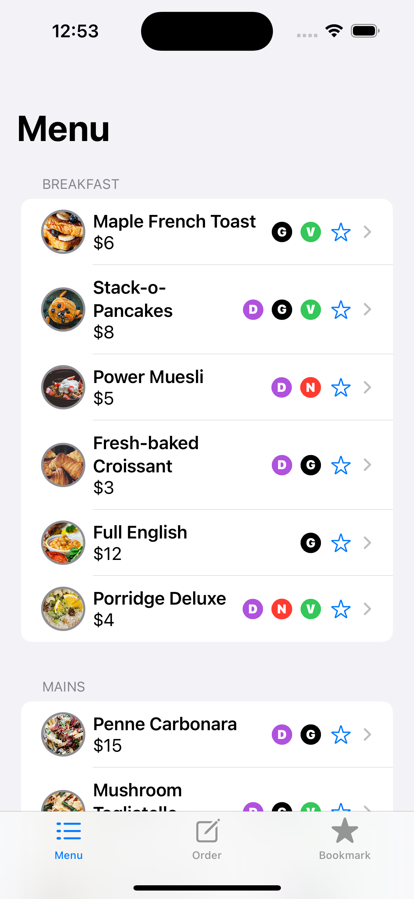

#### 메뉴를 터치하면 세부 사항을 볼 수 있습니다.

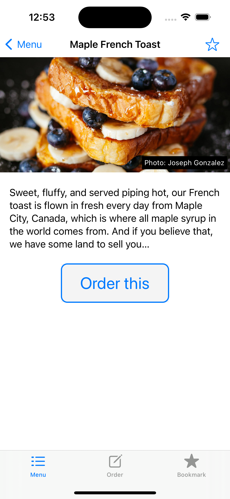

#### 메뉴 탭에서 order this를 터치하면 주문이 완료되고 order 탭에서 확인할 수 있습니다.

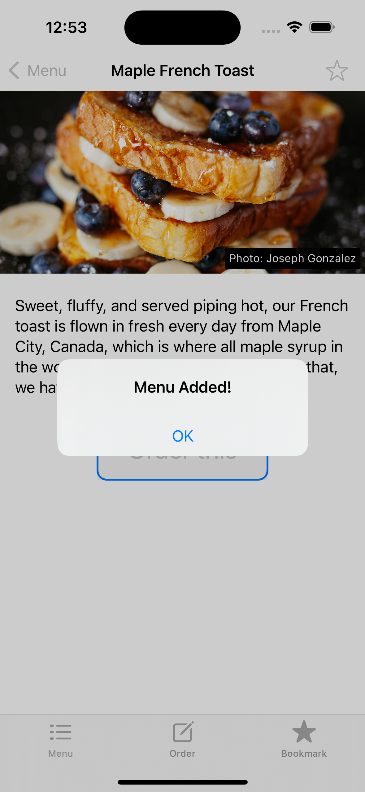
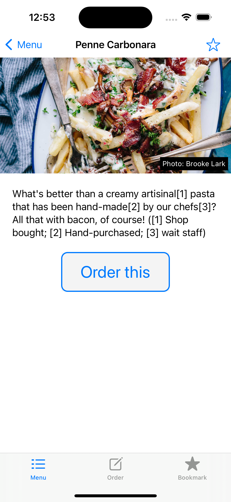
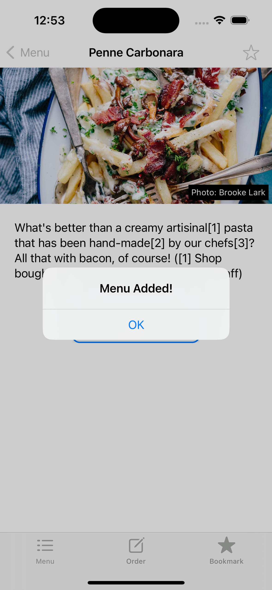

## order tab - 담은 메뉴를 확인하고 주문할 수 있습니다.

#### Edit 버튼으로 주문 메뉴를 삭제할 수 있습니다.

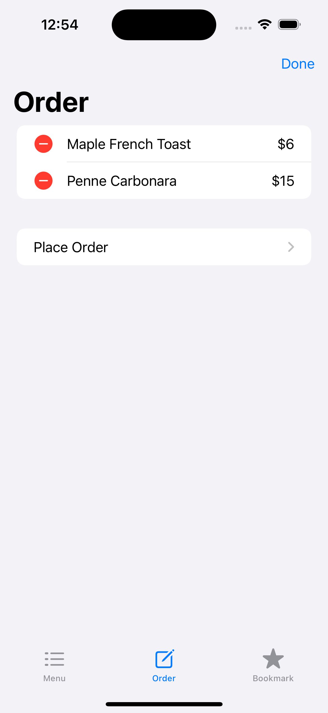
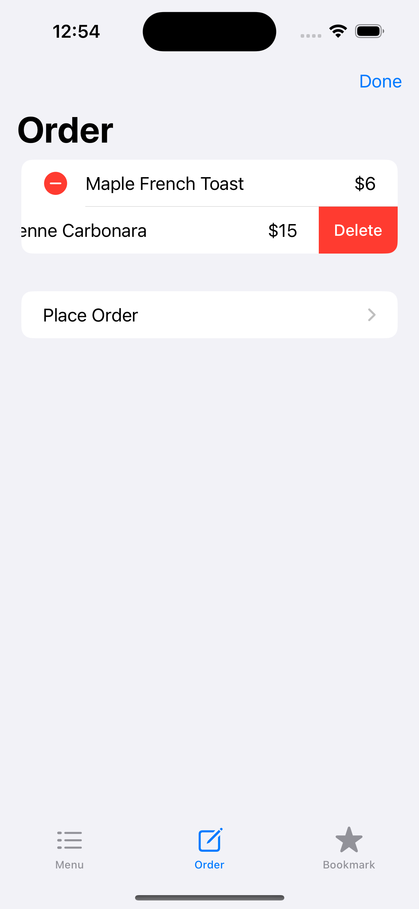
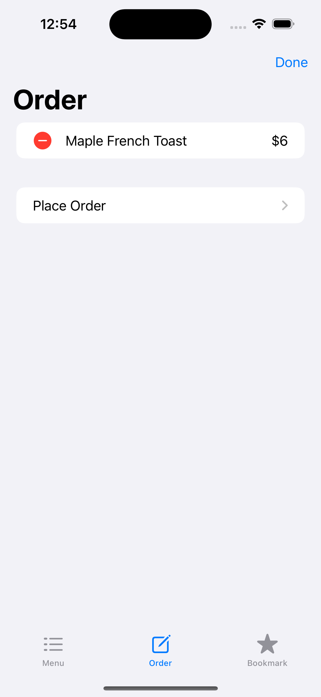
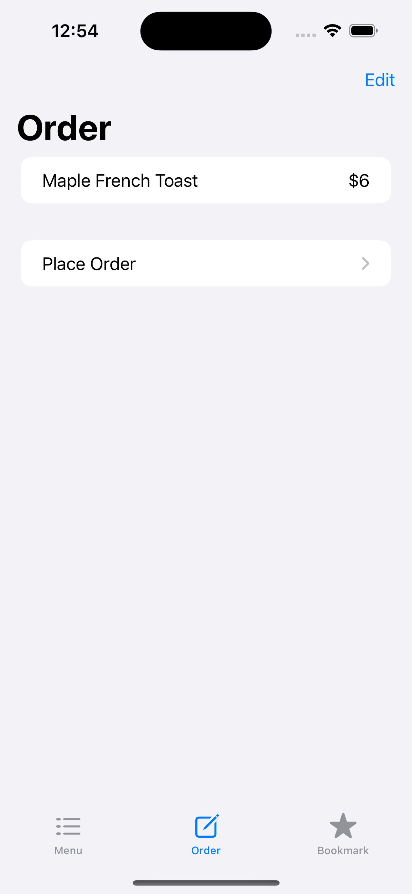

#### Place Order 버튼으로 최종 주문을 할 수 있습니다.

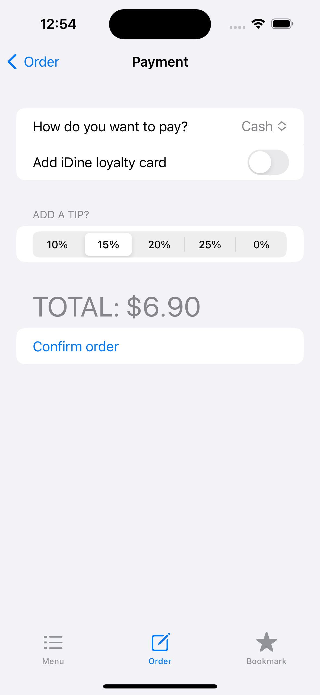

#### 결제 방법을 선택할 수 있습니다.

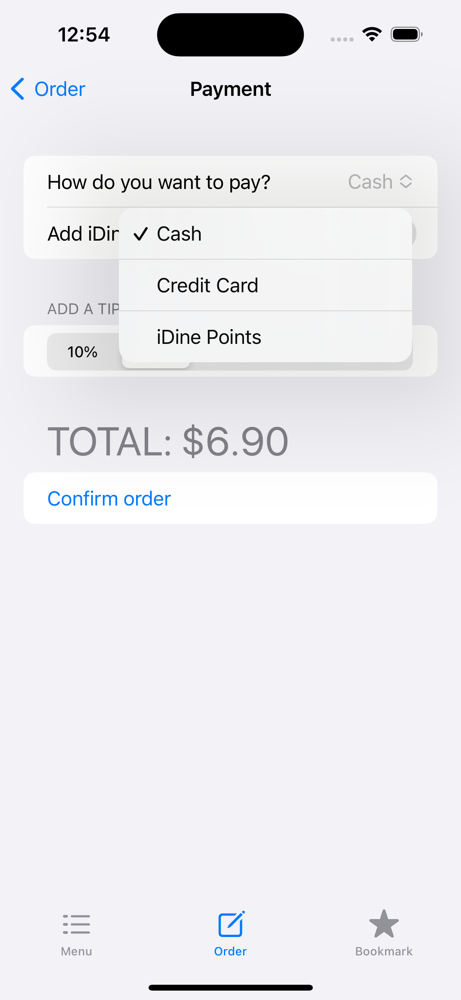
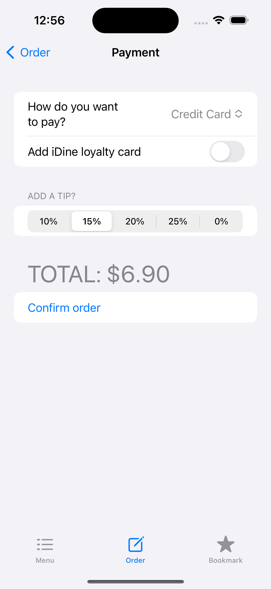

#### 로얄티 카드를 추가할 수 있습니다.

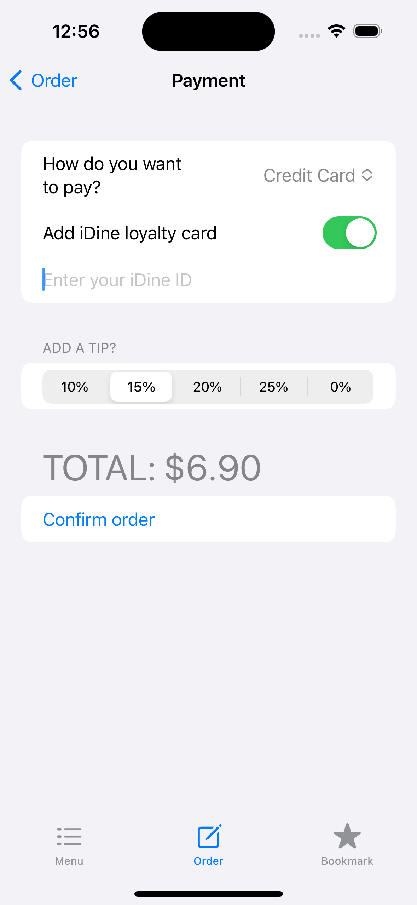

#### 팁 비율을 선택할 수 있습니다. 비율에 따라 최종 금액이 자동 계산됩니다.

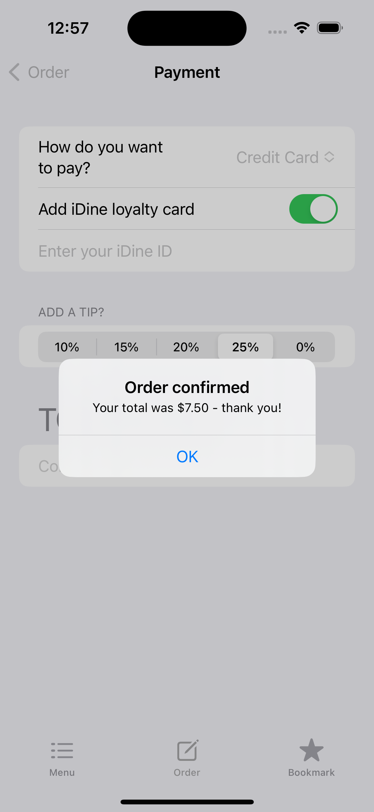

#### Confirm order 버튼을 누르면 최종 주문이 완료됩니다.

## bookmark tab - 저장한 즐겨찾기를 볼 수 있습니다.
#### 즐겨찾기는 메뉴 탭과 오더 탭에서 모두 추가 및 삭제가 가능합니다. (파란색 별표 버튼)

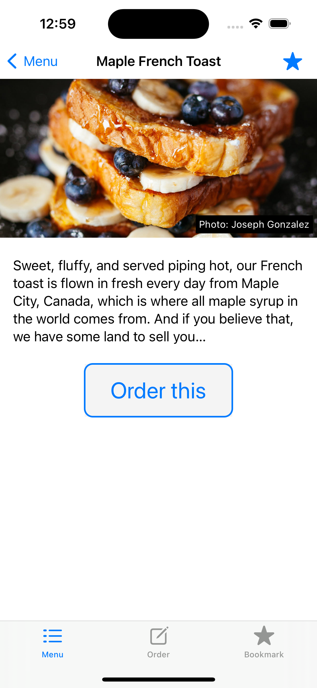
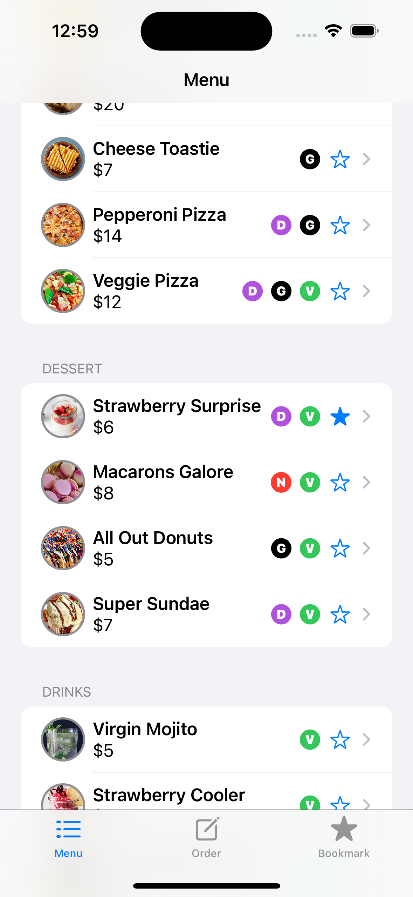
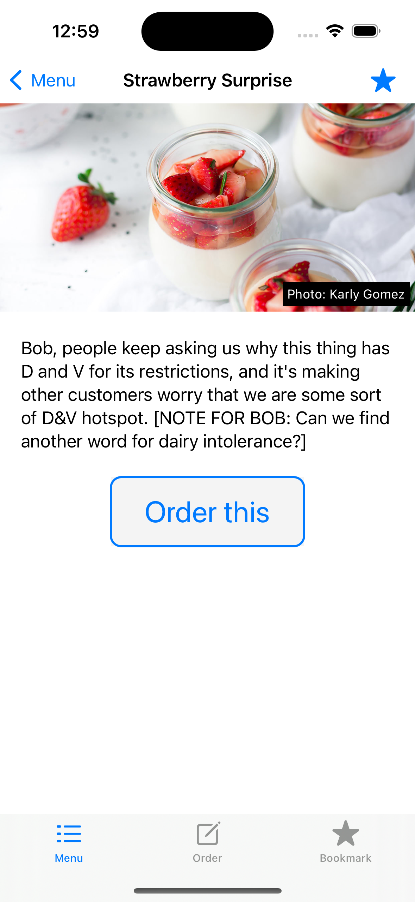
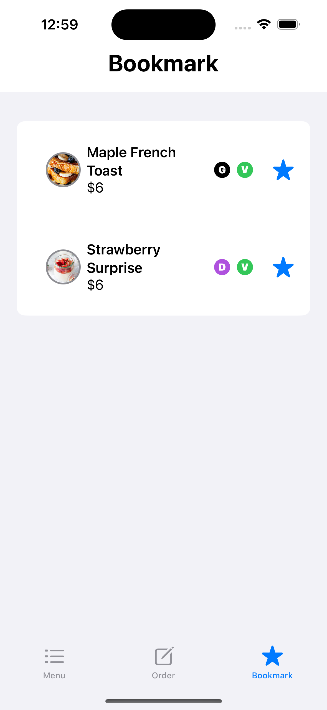

